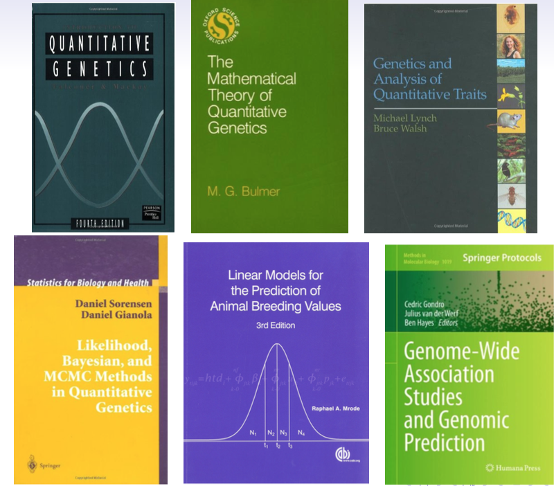

```{r setup, include=FALSE}
options(htmltools.dir.version = FALSE)
```

# Holidays
<div align="center">

</div>


---
# Statistical analysis of quantitative genetics
What we will cover

- genomic relationships
- genomic selection
- genome-enabled prediction 
- additive and non-additive effects
- genome-wide association study 
- genomic heritability
- statistical genomics of disease
- population stratification
- multiple-trait model
- causal inference 


---
# About the course
- [http://morotalab.org/apsc5984-2020/APSC5984.html](http://morotalab.org/apsc5984-2020/APSC5984.html)
- hands-on analysis of simulated or real genomic data
- no mideterm exams
- final exam 
- 15 minutes presentation 
- R + RStudio 


---
# Prediction vs. Inference - 1
- Complex traits
    - large number of genes with small effects 
    - genetics and environments

- Inference
    - effect of allele substitution
    - variance component estimation
  
- Prediction 
    - prediction of yet-to-be observed phenotypes
    - genomic selection


---
# Prediction vs. Inference - 2
<div align="center">

</div>

* [http://www.pnas.org/content/112/45/13892.abstract
](http://www.pnas.org/content/112/45/13892.abstract
)


---
# Reproducible Research
<iframe width="1000" height="500" src="https://www.youtube.com/embed/j7K3s_vi_1Y" frameborder="0" allowfullscreen></iframe>


---
# Reproducible research

Many scientific journals now require authors to make their **data** publicly available prior to publication.

- [Genetics](http://genetics.org/)
- [Genome Research](http://genome.cshlp.org/)
- [Heredity](http://www.nature.com/hdy/index.html)
- [PLoS Genetics](http://journals.plos.org/plosgenetics/)

and more. 

Some journals also encourage authors to share their **software or code** used for analysis


---
# Reproducible research tools

Examples
- README file
- GNU make
- Git/GitHub
- Jupyter Notebook
- [R markdown](http://rmarkdown.rstudio.com/) + [knitr](https://yihui.name/knitr/)

Submit .**Rmd** and .**html** files. 

---
# CRAN Task View: Reproducible Research
 [https://cran.r-project.org/web/views/ReproducibleResearch.html](https://cran.r-project.org/web/views/ReproducibleResearch.html)


---

# Homework assignments 

Grading policies

- reproducible data analysis 
- documentation of code 
- interpretation of results 

I encourage you to discuss with people in the class but **do not** share code


---
# Bibliography
<div align="center">

</div>


---

# Online R Tutorials

- [Code School: Try R](http://tryr.codeschool.com)
- [Rabbit: Introduction to R](http://www.quantide.com/rabbit-introduction-to-r/)
- [swirl](http://swirlstats.com/)
- [statsTeachR](http://www.statsteachr.org/)
- [The R Inferno](http://www.burns-stat.com/documents/books/the-r-inferno/)
- [An Introduction to Statistical and Data Sciences via R](https://ismayc.github.io/moderndiver-book/)

Useful cheat sheets
- [RStudio Cheat Sheets](https://www.rstudio.com/resources/cheatsheets/)

